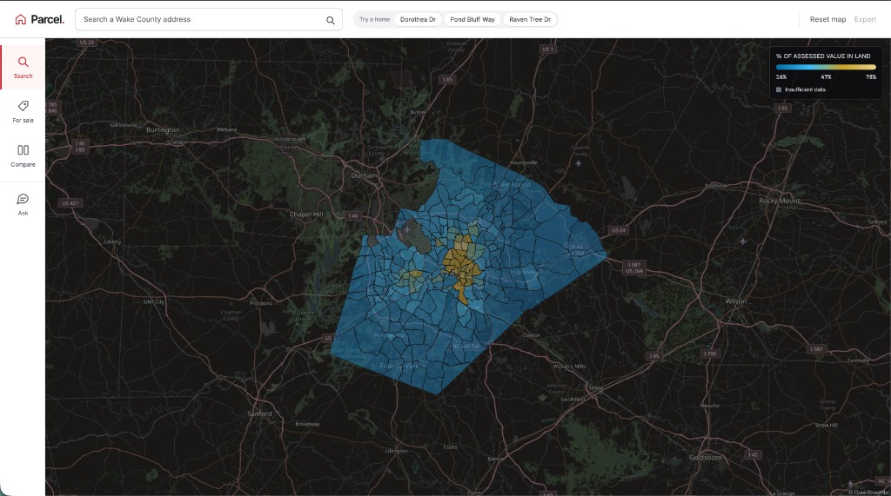
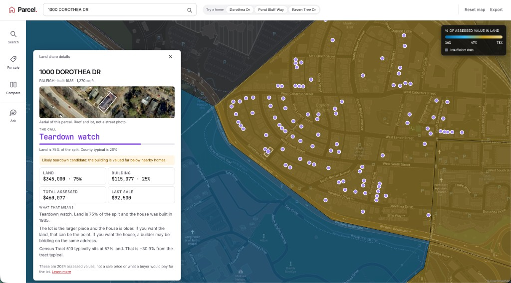
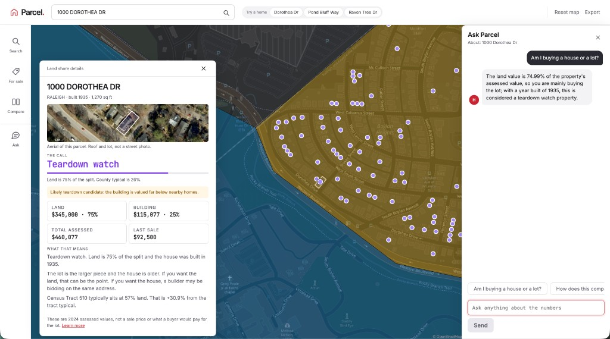
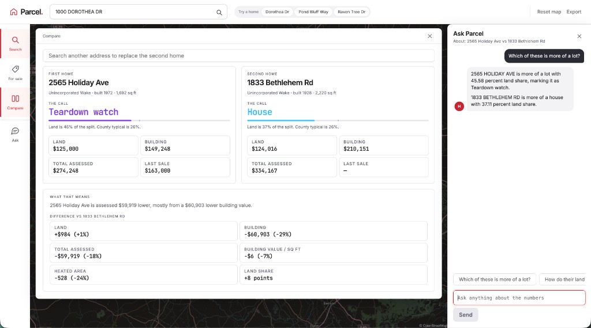
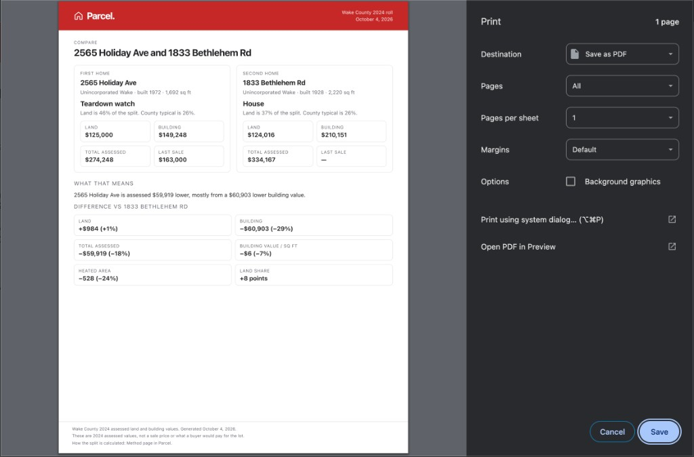

# Parcel

**Live site: [https://buyparcel.vip](https://buyparcel.vip)**

Buyers see one price. Wake County already prices two things: the dirt and the structure. Parcel splits them so you can tell whether you are buying a house to live in, or a lot that happens to have a house on it.

Built for WolfHacks 2026, Center for Geospatial Analytics track. Made with AI-assistance.



## Land share

Land share is the county land value divided by land plus building. Other assessed extras stay out of the denominator.

- Under 40 percent: **house**. Improvements and condition matter more than the lot.
- 40 percent or more: **lot**. A remodel will not change what the market is pricing.
- 40 percent or more and built in 1975 or earlier: **teardown watch**. You may be bidding against someone who will take the house down.

Those cutoffs are a buyer rule of thumb, not a legal standard. The dollars are Wake County 2024 assessed values, not a sale price.

## Search a house

Search any Wake County address. The card shows the split, an aerial of the parcel, and how the tract compares with the county typical.



## Ask

Ask a question about the selected home, a neighborhood, the county, or a compare pair. Answers use only the figures already on the page. The model is not allowed to invent a tax rate, a list price, or a rebuild cost.



## Compare and export

Put two homes, neighborhoods, or the county typical side by side. Export prints the same split for a judge or a buyer.





## For sale

For-sale pins are a cached snapshot of recent Wake listings (last 30 days). Filter by list price and land share. Opening a pin closes the filter card and looks up the county split. Reloading the site does not call RentCast.

## Data

Every land/building number traces to a public source. Nothing is modelled or imputed.

| Source | Used for |
| --- | --- |
| Wake County `Property/Parcels` ArcGIS service | land value, building value, year built, heated area, last sale, parcel outline |
| Census TIGER/Line | tract boundaries |
| ACS tables B25003, B25077, B25070 | owner occupancy, when shown |
| RentCast sale listings, cached on disk | for-sale pins and list price. The website never calls RentCast. |

## Run locally

```bash
.venv/bin/python api/server.py
```

In another terminal, from `web/`:

```bash
npm install
npm test
npm run dev
```

The local map is at http://127.0.0.1:5173/. The live map is [https://buyparcel.vip](https://buyparcel.vip).

To rebuild the county study from source:

```bash
.venv/bin/python pipeline/fetch_parcels.py
.venv/bin/python pipeline/fetch_housing.py
.venv/bin/python pipeline/build_land.py
.venv/bin/python pipeline/check_land.py
```

## Note

Made with AI-assistance.
